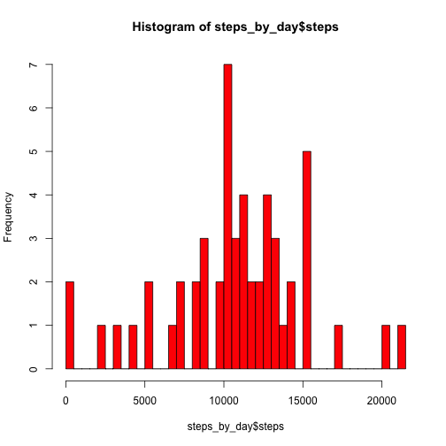

## Loading and preprocessing the data

Load the data

```r
zipfile <- "activity.zip"
unzip(zipfile)
datafile <- "activity.csv"
activity_data <- read.csv(datafile, na.strings="NA")
```

Process/transform the data (if necessary) into a format suitable for your analysis

```r
library(base)
activity_data$date <- as.Date(activity_data$date, "%Y-%m-%d")
# Let's convert times to fractions of an hour
hours <- floor(activity_data$interval / 100)
minutes <- (activity_data$interval %% 100) / 60
interval_numeric <- hours + minutes
activity_data$interval_numeric <- interval_numeric
```

# What is mean total number of steps taken per day?

For this part of the assignment, we can ignore the missing values in the dataset.

```r
bad <- is.na(activity_data$steps)
clean_activity_data <- activity_data[!bad,]
```

Calculate the total number of steps taken per day

```r
library(plyr)
steps_by_day <- ddply(clean_activity_data, .(date), summarize, steps=sum(steps))
```

Make a histogram of the number of steps taken each day

```r
hist(steps_by_day$steps, breaks=nrow(steps_by_day), col="red")
```

 

Calculate and report the mean and median of the total number of steps taken per day

```r
mean(steps_by_day$steps)
```

```
## [1] 10766.19
```

```r
median(steps_by_day$steps)
```

```
## [1] 10765
```

## What is the average daily activity pattern?

Make a time series plot (i.e. type="l") of the 5-minute interval (x-axis) and the average number of steps taken, averaged across all days (y-axis)

```r
interval_data <- ddply(clean_activity_data, .(interval_numeric), summarize, mean_steps=mean(steps))
plot(mean_steps~interval_numeric, data=interval_data, type="l", xlab="Interval's Time of Day (hours)", ylab="Mean number of steps for intervals")
```

 

Which 5-minute interval, on average across all days in the dataset, contains the maximum number of steps?

```r
interval_data[interval_data$mean_steps==max(interval_data$mean_steps),]
```

```
##     interval_numeric mean_steps
## 104         8.583333   206.1698
```

## Imputing missing values

Note that there are a number of days/intervals where there are missing values, (coded as NA). The presence of missing days may introduce bias into some calculations or summaries of the data.

Calculate and report the total number of missing values in the dataset (i.e the total number of rows with NAs)

```r
length(bad[bad==TRUE])
```

```
## [1] 2304
```

Devise a strategy for filling in all of the missing values in the dataset. The strategy does not need to be sophisticated. For example, you could use the mean/median for that day, or the mean for that 5-minute interval, etc...

```r
# TODO - something more sophisticated. For now, put the mean steps per interval for anything missing
```

Create a new dataset that is equal to the original dataset but with the missing data filled in.

```r
imputed_activity_data <- activity_data
imputed_activity_data[bad,]$steps <- mean(interval_data$mean_steps)
```

Make a histogram of the total number of steps taken each day and Calculate and report the mean and median total number of steps taken per day.

```r
imputed_steps_by_day <- ddply(imputed_activity_data, .(date), summarize, steps=sum(steps))
hist(imputed_steps_by_day$steps, col="red", breaks=nrow(imputed_steps_by_day))
```

 

```r
mean(imputed_steps_by_day$steps)
```

```
## [1] 10766.19
```

```r
median(imputed_steps_by_day$steps)
```

```
## [1] 10766.19
```

Do these values differ from the estimates from the first part of the assignment? What is the impact of imputing missing data on the estimates of the total daily number of steps?

```r
# Imputing missing data by using the mean steps per interval does not seem to skew the results much. The histograms look almost similar and there's only a slight change to the median (matches the mean, makes sense)
```

## Are there differences in activity patterns between weekdays and weekends?

Create a new factor variable in the dataset with two levels "weekday" and "weekend" indicating whether a given date is a weekday or a weekend day

```r
is_weekday <- weekdays(activity_data$date) %in% c("Monday", "Tuesday", "Wednesday", "Thursday", "Friday")

make_weekday_factor <- function(is_weekday) {
  if (is_weekday) {
    "weekday"
  } else {
    "weekend"
  }
}

activity_data$weekday_factor <- as.factor(sapply(is_weekday, make_weekday_factor))
clean_activity_data <- activity_data[!bad,]
```

Make a panel plot containing a time series plot of the 5-minute interval (x-axis) and the average number of steps taken, averaged across all weekday days or weekend days (y-axis).

```r
weekday_activity_data <- ddply(clean_activity_data, .(weekday_factor, interval_numeric), summarize, mean_steps=mean(steps))
library(ggplot2)
g <- ggplot(weekday_activity_data, aes(x=interval_numeric, y=mean_steps, group=weekday_factor, color=weekday_factor))
# TODO - switch out the points with the lines. geom_line?
# gfinal <- g +
#     geom_point(aes(color=weekday_factor)) + 
#     geom_line() +
#     facet_wrap(~weekday_factor, nrow=2, ncol=1, scales="free_y") +
gfinal <- g +
    geom_point() + 
    geom_line() +
    facet_wrap(~weekday_factor, nrow=2, ncol=1, scales="free_y")
print(gfinal)
```

 
